# GPUaaS with Red Hat Advanced Cluster Management

**GPU-as-a-Service using MultiKueue and RHACM for Kubernetes-native Job Queueing at Scale**

---

## 📚 Documentation

| Section | Description |
|---------|-------------|
| [**Concepts**](docs/concepts.md) | Learn about Kueue, MultiKueue, and RHACM integration |
| [**Prerequisites**](docs/00-prerequisites.md) | What you need before starting |
| [**Architecture**](docs/01-architecture.md) | Technical deep dive |
| [**Installation**](docs/02-installation.md) | Step-by-step setup |
| [**Troubleshooting**](docs/99-troubleshooting.md) | Known issues & fixes |

### 🎯 Demo Scenarios

| Scenario | Description | Difficulty |
|----------|-------------|------------|
| [**Scenario 1: Basic**](scenarios/scenario1-basic/) | Dispatch to all clusters | ⭐ Beginner |
| [**Scenario 2: Label-Based**](scenarios/scenario2-label-based/) | Target specific GPU types | ⭐⭐ Intermediate |
| [**Scenario 3: Dynamic Score**](scenarios/scenario3-dynamic-score/) | Real-time GPU availability | ⭐⭐⭐ Advanced |

---

## Overview

This repository provides step-by-step instructions for setting up GPU-as-a-Service (GPUaaS) across multiple OpenShift clusters using:

- **Red Hat Build of Kueue (RHBoK)** - Kubernetes-native job scheduler optimized for batch workloads
- **MultiKueue** - Extends Kueue functionality into a multi-cluster environment
- **Red Hat Advanced Cluster Management (RHACM)** - Automates deployment, configuration, and integration of MultiKueue with Placement

## 🖥️ Demo Environment

This demo uses **3 OpenShift clusters** - 1 hub and 2 spoke clusters with different capabilities:

| Cluster | Role | Hardware | Labels | Purpose |
|---------|------|----------|--------|---------|
| **Hub** | RHACM Hub + Kueue Manager | CPU only | - | Manages workload dispatch |
| **spoke-cluster1** | Worker | **NVIDIA L4 GPUs** | `accelerator=nvidia-l4` | GPU workloads |
| **spoke-cluster2** | Worker | CPU only | `cluster-type=cpu-only` | CPU workloads |

```mermaid
flowchart TB
    subgraph hub["🖥️ HUB CLUSTER"]
        rhacm["RHACM + MultiKueue"]
    end
    
    subgraph spoke1["spoke-cluster1"]
        gpu["🟢 NVIDIA L4 GPUs x4"]
        label1["accelerator: nvidia-l4"]
    end
    
    subgraph spoke2["spoke-cluster2"]
        cpu["⚪ CPU Only"]
        label2["cluster-type: cpu-only"]
    end
    
    hub -->|"GPU Jobs"| spoke1
    hub -->|"CPU Jobs"| spoke2
    
    style hub fill:#1a1a2e,stroke:#4fc3f7,stroke-width:2px,color:#fff
    style spoke1 fill:#1a1a2e,stroke:#66bb6a,stroke-width:2px,color:#fff
    style spoke2 fill:#1a1a2e,stroke:#90a4ae,stroke-width:2px,color:#fff
```



> **Note:** The scenarios demonstrate how Placement selects the right cluster based on workload requirements (GPU vs CPU).

## How It Works


1. **Kueue** is made available via the Red Hat Build of Kueue (RHBoK) operator from OperatorHub
2. **RHACM** distributes and installs RHBoK to managed clusters via an add-on
3. **The add-on automates** deployment and configuration of MultiKueue
4. **Two Admission Check Controllers** are installed - one for MultiKueue dispatch, one for RHACM Placement integration

## Why MultiKueue + RHACM?

| Challenge | Solution |
|-----------|----------|
| Fragmented GPU workloads across clusters | Cross-cluster shared resources via MultiKueue |
| "Which cluster has available GPUs?" | RHACM Placement with label-based or score-based selection |
| Complex MultiKueue configuration | RHACM add-on automates everything |
| Manual kubeconfig management | RHACM generates MultiKueueConfig automatically |

## Architecture


**Workflow:**


1. **Cluster admin creates Placement** - defines which clusters should receive workloads
2. **RHACM hub runs two admission check controllers** - RHACM controller and MultiKueue controller
3. **RHACM Admission Check Controller** converts Placement to MultiKueue workload dispatching
4. **RHBoK MultiKueue Admission Check Controller** orchestrates dispatch to specific worker clusters
5. **Jobs are scheduled** with Kueues on RHACM managed clusters based on Placement criteria

## Demo Scenarios

| Scenario | Description | Use Case |
|----------|-------------|----------|
| [Scenario 1: Basic](scenarios/scenario1-basic/) | Dispatch jobs to all managed clusters | Simple load distribution |
| [Scenario 2: Label-Based](scenarios/scenario2-label-based/) | Select clusters by GPU type label | Target specific GPU hardware |
| [Scenario 3: Dynamic Score](scenarios/scenario3-dynamic-score/) | Select clusters by real-time GPU availability | Optimal resource utilization |

## Quick Start

### Prerequisites Check

```bash
# On Hub Cluster
oc get multiclusterhub -A                    # RHACM installed?
oc get csv -n openshift-kueue-operator       # Kueue Operator installed?
oc get managedclusters                       # Managed clusters available?
```

### Step-by-Step Guides

1. **[Prerequisites](docs/00-prerequisites.md)** - Required components and cluster setup
2. **[Architecture](docs/01-architecture.md)** - Deep dive into components
3. **[Installation](docs/02-installation.md)** - Install Kueue Operator and RHACM Add-on
4. **Demo Scenarios:** (each folder contains README + manifests)
   - [Scenario 1: Basic MultiKueue](scenarios/scenario1-basic/)
   - [Scenario 2: Label-Based Selection](scenarios/scenario2-label-based/)
   - [Scenario 3: Dynamic Score-Based Selection](scenarios/scenario3-dynamic-score/)
5. **[Troubleshooting](docs/99-troubleshooting.md)** - Known issues and workarounds

## Directory Structure

```
GPUaaS-RHACM/
├── README.md                               # This file
├── assets/                                 # Architecture diagrams
│   ├── 01-overview-4-steps.png
│   ├── 02-workflow-5-steps.png
│   └── 03-architecture-detailed.png
├── docs/
│   ├── 00-prerequisites.md                 # Prerequisites
│   ├── 01-architecture.md                  # Architecture overview
│   ├── 02-installation.md                  # Installation guide
│   └── 99-troubleshooting.md               # Known issues & workarounds
├── scenarios/
│   ├── scenario1-basic/                    # Scenario 1: Basic MultiKueue
│   │   ├── README.md                       # Instructions
│   │   └── manifests/                      # YAML files
│   ├── scenario2-label-based/              # Scenario 2: Label-based selection
│   │   ├── README.md                       # Instructions
│   │   └── manifests/                      # YAML files
│   └── scenario3-dynamic-score/            # Scenario 3: Score-based selection
│       ├── README.md                       # Instructions
│       └── manifests/                      # YAML files
└── scripts/
    └── fix-spoke-clusterqueues.sh          # Workaround script
```

## References

- [Kueue Documentation](https://kueue.sigs.k8s.io/)
- [MultiKueue Setup Guide](https://kueue.sigs.k8s.io/docs/concepts/multikueue/)
- [RHACM Kueue Add-on (upstream)](https://github.com/open-cluster-management-io/addon-contrib/tree/main/kueue-addon)
- [OCM MultiKueue Integration](https://github.com/open-cluster-management-io/ocm/pull/1165)

## ⚠️ Important: Known Issue & Workaround

There is a known issue where the RHACM kueue-addon incorrectly deploys hub's ClusterQueue configuration (with admission checks) to spoke clusters. **Spoke clusters should NOT have admission checks.**

**Workaround:** After deploying any scenario, run:

```bash
./scripts/fix-spoke-clusterqueues.sh
```

See [Troubleshooting](docs/99-troubleshooting.md) for details.

## Status

This feature is in **Developer Preview** in RHACM 2.15.

### Tested Environment

- **RHACM:** 2.15
- **OpenShift:** 4.18
- **Kueue Operator:** 1.2.x
- **GPU:** NVIDIA L4

## License

Apache-2.0
