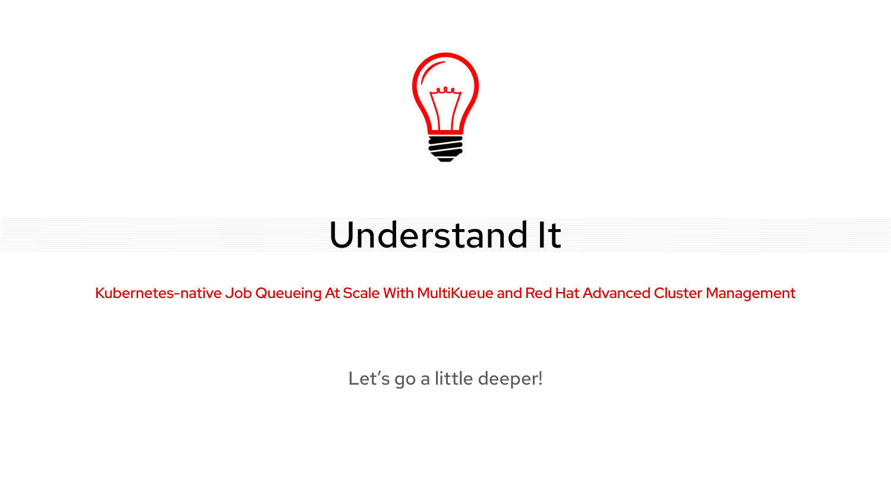
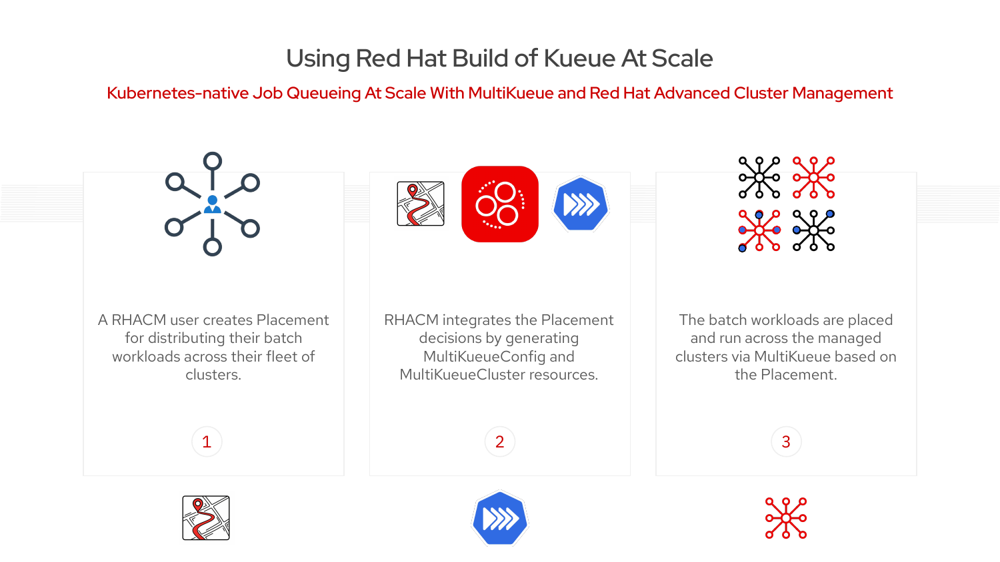

# Concepts

## Overview: WHAT, WHY, HOW


---

## What is Kueue?

**Kueue** is a Kubernetes-native job scheduler that improves on the default Kubernetes scheduler by optimizing for **batch workloads**.

### Key Capabilities

| Feature | Description |
|---------|-------------|
| **Job Queueing** | Queue jobs when resources aren't immediately available |
| **Resource Quotas** | Define resource limits per team/project |
| **Fair Sharing** | Distribute resources fairly across queues |
| **Priority-based Scheduling** | Higher priority jobs get resources first |
| **Preemption** | Evict lower priority jobs when needed |
| **Resource Bursting** | Temporarily exceed quotas when capacity is available |

### Why Kueue for AI/ML Workloads?

- **GPU Optimization**: Efficiently schedule GPU-intensive training jobs
- **Long-running Jobs**: Handle jobs that run for hours or days
- **Batch Processing**: Optimize for throughput, not just latency
- **Resource Management**: Prevent GPU starvation across teams


## The Limits of Single-Cluster Kueue

Without MultiKueue, organizations face challenges:

| Problem | Who Faces It | Impact |
|---------|--------------|--------|
| "Which cluster is best for my job?" | Data Scientists | Time wasted finding GPUs |
| "I need more GPU but I'm not sure where to get it" | Data Scientists | Blocked work, missed deadlines |
| "Why is no one using these GPUs?" | Hub Admins | Wasted resources, poor utilization |
| "How do I configure all these Kueues?" | Hub Admins | Complex setup, support burden |

**Result:** Fragmented workloads and under-utilized resources across clusters.

---

## What is RHACM?

**Red Hat Advanced Cluster Management (RHACM)** is a multi-cluster management platform that provides:

- **Cluster lifecycle management** - create, import, upgrade clusters
- **Application deployment** - deploy apps across clusters
- **Policy enforcement** - ensure compliance across fleet
- **Observability** - monitor all clusters from one place

### How RHACM Enables MultiKueue



### The Kueue Add-on



An **add-on** is a framework provided by RHACM for managing the configuration and lifecycle of operators on managed clusters.

| Component | Description |
|-----------|-------------|
| **RHBoK Operator** | Made available via Operator Hub, distributed to managed clusters by RHACM add-on |
| **Add-on Agent** | Runs in each managed cluster, applies configurations from hub |
| **Admission Check Controllers** | Two controllers: MultiKueue controller + Placement-to-MultiKueue converter |

The add-on:
1. Automates deployment and configuration of MultiKueue
2. Provides hassle-free integration into your existing environment
3. Generates `MultiKueueConfig` and `MultiKueueCluster` resources from RHACM Placement decisions

### Key RHACM Concepts for MultiKueue

| Concept | Description |
|---------|-------------|
| **ManagedCluster** | A cluster registered with RHACM hub |
| **ManagedClusterSet** | Group of clusters (e.g., "gpu-clusters") |
| **Placement** | Rules for selecting clusters |
| **PlacementDecision** | Result of Placement evaluation |
| **AddOn** | Optional capability installed on managed clusters |

### Placement: The Key Integration Point

**Placement** is how RHACM selects clusters for workloads:

```yaml
apiVersion: cluster.open-cluster-management.io/v1beta1
kind: Placement
metadata:
  name: gpu-placement
spec:
  predicates:
    - requiredClusterSelector:
        labelSelector:
          matchLabels:
            accelerator: nvidia-l4  # Only clusters with this label
  numberOfClusters: 1              # Select the best one
  prioritizerPolicy:
    configurations:
    - scoreCoordinate:
        type: AddOn
        addOn:
          scoreName: gpuAvailable  # Use GPU availability score
```


## Personas and Use Cases

### Separation of Concerns

The power of RHACM + MultiKueue is the **clear separation between administration and usage**:

| Persona | Needs to Know | Doesn't Need to Know |
|---------|---------------|---------------------|
| **RHACM Admin** | How to create Placements | How to write Kueue jobs |
| **Data Scientist** | How to use Kueue LocalQueues | How Placement works, which clusters exist |

> **Key Insight:** RHACM is just the engine to drive the outcomes designed and desired by the users.

---

### RHACM Admin Workflow

The hub admin enables GPU-as-a-Service for their organization:

```
┌─────────────────────────────────────────────────────────────────────────┐
│  RHACM ADMIN WORKFLOW                                                   │
├─────────────────────────────────────────────────────────────────────────┤
│  1. Enable MultiKueue Addon                                             │
│     └─→ Addon installs RHBoK on Hub (Manager Cluster)                  │
│     └─→ Addon installs RHBoK on managed clusters (Worker Clusters)     │
│     └─→ Addon installs "RHACM Admission Check Controller"              │
│                                                                         │
│  2. Create Placements for different use cases                          │
│     └─→ GPUPlacement: clusters with nvidia GPUs                        │
│     └─→ CPUPlacement: CPU-only clusters                                │
│     └─→ GoldGPUPlacement: premium GPU clusters (charge more?)          │
│                                                                         │
│  3. RHACM Admission Check Controller converts Placements               │
│     └─→ Creates properly configured Kueue + MultiKueue resources       │
│     └─→ Standard Kueue controller manages MultiKueue config            │
│                                                                         │
│  4. Hub is now a functioning Kueue Manager Cluster                     │
│     └─→ Ready to receive jobs from Data Scientists                     │
└─────────────────────────────────────────────────────────────────────────┘
```

**Admin creates LocalQueues for different tiers:**

| LocalQueue | Backed By | Target Users | Cost Model |
|------------|-----------|--------------|------------|
| `gpu-queue` | GPUPlacement | ML Engineers | Standard |
| `cpu-queue` | CPUPlacement | Data Processing | Standard |
| `gold-gpu-queue` | GoldGPUPlacement | Priority Users | Premium |

---

### Data Scientist Workflow

Data scientists **only need to know which LocalQueue to use**:

```
┌─────────────────────────────────────────────────────────────────────────┐
│  DATA SCIENTIST WORKFLOW                                                │
├─────────────────────────────────────────────────────────────────────────┤
│  1. Ask Admin: "Which queue should I use?"                             │
│     └─→ "Use gpu-queue for GPU training"                               │
│     └─→ "Use cpu-queue for data preprocessing"                         │
│     └─→ "Use gold-gpu-queue for critical jobs (costs more)"            │
│                                                                         │
│  2. Submit job with queue label                                        │
│     └─→ labels:                                                        │
│           kueue.x-k8s.io/queue-name: gpu-queue                         │
│                                                                         │
│  3. Job automatically runs on best available cluster                   │
│     └─→ No need to know which cluster                                  │
│     └─→ No need for multiple kubeconfigs                               │
│     └─→ Results sync back to hub                                       │
└─────────────────────────────────────────────────────────────────────────┘
```

**What Data Scientists DON'T need to know:**
- Which clusters exist
- How Placement works
- MultiKueue configuration
- Cluster networking or credentials

---

## Red Hat OpenShift AI: The Foundation

**Red Hat OpenShift AI** is an enterprise-ready platform for managing AI workloads at scale. It provides:

| Component | Description |
|-----------|-------------|
| **Jupyter Notebooks** | Model development environment |
| **Data Pipelines** | Orchestration frameworks |
| **Model Serving** | KServe/vLLM for inference |
| **Monitoring** | Prometheus-based observability |
| **Kueue** | Kubernetes-native GPU scheduling |

!!! info "Key Insight"
    **OpenShift AI already includes Kueue** for single-cluster GPU scheduling. 
    **RHACM + MultiKueue** extends this to multi-cluster environments.

### Personas and Entry Points

| Persona | What They Do | Entry Point | GPU Needs |
|---------|--------------|-------------|-----------|
| **Data Scientist** | Train models, experiments, feature engineering | OpenShift AI (Jupyter) | ✅ Yes (training) |
| **ML Engineer** | Deploy models, MLOps pipelines, serving | OpenShift AI (KServe/vLLM) | ✅ Yes (inference) |
| **AI Engineer** | Build AI agents and applications | MCP Servers | Indirectly (via inference APIs) |
| **Platform Admin** | Manage clusters, quotas, placements | RHACM Console | ❌ No |

### AI Agents in the Picture

AI agents (built with Claude SDK, Google ADK, LlamaStack, LangGraph, etc.) interact with OpenShift AI via **MCP Servers**:

```
┌─────────────────────────────────────────────────────────────────────────┐
│  AI AGENTS (any framework)                                              │
│  Claude Agent │ Google ADK │ LlamaStack │ LangGraph │ ...              │
└────────────────────────────┬────────────────────────────────────────────┘
                             │ MCP Protocol
                             ▼
┌─────────────────────────────────────────────────────────────────────────┐
│  MCP SERVERS (deployed on OpenShift AI)                                 │
│  └─ Expose tools: run_inference(), submit_training_job(), etc.         │
└────────────────────────────┬────────────────────────────────────────────┘
                             │
                             ▼
┌─────────────────────────────────────────────────────────────────────────┐
│  OPENSHIFT AI + KUEUE + MULTIKUEUE → GPU CLUSTERS                      │
└─────────────────────────────────────────────────────────────────────────┘
```

!!! info "Important Distinction"
    **Agentic workloads and MCP servers do NOT need GPUs** to run. They orchestrate and coordinate work. 
    **LLMs (Large Language Models)** are what need GPUs for inference and training.

### How It Works

```
┌─────────────────────────────────────────────────────────────────────────┐
│  DATA SCIENTIST TOOLS (No GPU required for these)                       │
│  ┌───────────────┐  ┌───────────────┐  ┌───────────────┐               │
│  │    RHOAI      │  │  MCP Servers  │  │     ETC       │               │
│  │  • Jupyter    │  │  • Agentic AI │  │  • CLI        │               │
│  │  • Pipelines  │  │  • Orchestrate│  │  • Custom     │               │
│  └───────┬───────┘  └───────┬───────┘  └───────┬───────┘               │
│          │                  │                  │                        │
│          └──────────────────┼──────────────────┘                        │
│                             ▼                                           │
│           Submit LLM/Training Jobs to Kueue LocalQueues                 │
│                   (GPU-intensive workloads)                             │
└─────────────────────────────────────────────────────────────────────────┘
                              │
                              ▼
┌─────────────────────────────────────────────────────────────────────────┐
│  RHACM HUB + MULTIKUEUE                                                 │
│  • Kueue queues receive jobs                                            │
│  • Placement rules determine best GPU cluster                           │
│  • MultiKueue dispatches to worker clusters                             │
└─────────────────────────────────────────────────────────────────────────┘
                              │
                              ▼
┌─────────────────────────────────────────────────────────────────────────┐
│  GPU WORKER CLUSTERS (GPU required for these workloads)                 │
│  • LLM Inference (Llama, Mistral, etc.)                                │
│  • Model Training                                                       │
│  • Fine-tuning (LoRA, QLoRA)                                           │
│  • Embedding generation                                                 │
└─────────────────────────────────────────────────────────────────────────┘
```

### The Challenge

**Data Scientists** using RHOAI face common problems:

> "I need more GPU but I'm not sure where I can get it."

> "Which cluster is best for my training job?"

**Hub Administrators** struggle too:

> "Why is no one using these GPUs?"

> "How do I configure all these Kueues? I'm not a Kueue expert!"

### The Solution

With RHACM + MultiKueue:

1. **Data scientists use their preferred tools** (RHOAI, MCP, CLI)
2. **Submit GPU-intensive jobs** to Kueue LocalQueues on the hub
3. **Placement routes jobs** to clusters with available GPUs
4. **Jobs run on the best cluster** - automatically selected
5. **Results sync back** to the hub


### Key Benefits for AI/ML Teams

- **Tool flexibility** - use RHOAI, MCP servers, or any client
- **No cluster hunting** - submit to one queue, get best cluster
- **Optimal GPU utilization** - jobs go where GPUs are available
- **Simplified operations** - RHACM addon handles configuration
- **Scale easily** - add clusters to the ManagedClusterSet

---

## Multi-Team Scenario: Different Queues for Different Needs

Organizations can set up **separate LocalQueues backed by different Placements**:


### Queue Configuration by Admin

| LocalQueue | Placement | Target Clusters | Who Uses It |
|------------|-----------|-----------------|-------------|
| `gpu-queue` | GPUPlacement | Clusters with `accelerator=nvidia-*` | ML training jobs |
| `cpu-queue` | CPUPlacement | Clusters with `cluster-type=cpu-only` | ETL, preprocessing |
| `gold-gpu-queue` | GoldGPUPlacement | Premium A100 clusters | Critical/priority jobs |

### How It Works

1. **Admin creates Placements** with cluster selection criteria
2. **Admin creates LocalQueues** linked to each Placement via ClusterQueue + AdmissionCheck
3. **Admin tells users** which queue to use based on their needs
4. **Users submit jobs** with the appropriate queue label
5. **RHACM routes jobs** to the right clusters automatically

### Example: Tiered GPU Service

```yaml
# User submits to standard GPU queue
labels:
  kueue.x-k8s.io/queue-name: gpu-queue

# Power user submits to premium queue (faster, more GPUs)
labels:
  kueue.x-k8s.io/queue-name: gold-gpu-queue
```

The admin can even implement **chargeback** - premium queues cost more!


## The Value of RHACM + MultiKueue

| Benefit | Description |
|---------|-------------|
| **Cross-cluster shared resources** | Run jobs on many clusters from a single entry point |
| **Integration with RHACM Placement** | Use labels, scores, and policies for cluster selection |
| **Automatic configuration** | Add-on handles all MultiKueue setup |
| **Centralized management** | Queue resources managed from a single hub |
| **Intelligent workload placement** | Enhanced multicluster scheduling |

### Why Use RHACM for MultiKueue?

- **GPU as a Service** - Centralized GPU resource management
- **Multi-cloud support** - Heterogeneous environments (AWS, Azure, on-prem)
- **Supported solution** - RHBoK from Red Hat, MultiKueue via RHACM add-on
- **Gateway to fleet management** - Cloud, managed, and bare metal support

> **Status:** Developer Preview in RHACM 2.15


## Resources

| Resource | Link |
|----------|------|
| OCM + MultiKueue Quick Setup | [addon-contrib/kueue-addon](https://github.com/open-cluster-management-io/addon-contrib/tree/main/kueue-addon) |
| MultiKueue Documentation | [kueue.sigs.k8s.io/docs/concepts/multikueue](https://kueue.sigs.k8s.io/docs/concepts/multikueue/) |
| RHACM Documentation | [Red Hat ACM Docs](https://access.redhat.com/documentation/en-us/red_hat_advanced_cluster_management_for_kubernetes) |


## Next Steps

- [Prerequisites](00-prerequisites.md) - What you need before starting
- [Architecture](01-architecture.md) - Technical deep dive
- [Installation](02-installation.md) - Step-by-step setup
