# Concepts

## Overview: WHAT, WHY, HOW

| | WHAT | WHY | HOW |
|---|------|-----|-----|
| **1** | Kueue is a Kubernetes-native job scheduler | Kueue improves on the default Kubernetes scheduler by optimizing for batch workloads | Kueue's MultiKueue mode extends this functionality into a multi-cluster environment |
| **2** | It's used for anything from standard services to complex AI/ML workloads | Kueue allows for resource bursting, quotas, K8s-optimized utilization, and more | RHACM installs, configures, and integrates MultiKueue with Placement across clusters |

---

## What is Kueue?

**Kueue** is a Kubernetes-native job scheduler that improves on the default Kubernetes scheduler by optimizing for **batch workloads**.

### Key Capabilities

| Feature | Description |
|---------|-------------|
| **Job Queueing** | Queue jobs when resources aren't immediately available |
| **Resource Quotas** | Define resource limits per team/project |
| **Fair Sharing** | Distribute resources fairly across queues |
| **Priority-based Scheduling** | Higher priority jobs get resources first |
| **Preemption** | Evict lower priority jobs when needed |
| **Resource Bursting** | Temporarily exceed quotas when capacity is available |

### How Kueue Works

```mermaid
flowchart TD
    A[User submits Job] --> B[Workload created]
    B --> C[Job suspended]
    C --> D[Workload queued in LocalQueue]
    D --> E{ClusterQueue evaluates}
    E --> F{Quota available?}
    E --> G{AdmissionChecks pass?}
    F --> |Yes| H[Job unsuspended]
    G --> |Yes| H
    H --> I[✅ Job runs on cluster]
    
    style A fill:#4fc3f7,color:#000
    style I fill:#66bb6a,color:#000
```



### Why Kueue for AI/ML Workloads?

- **GPU Optimization**: Efficiently schedule GPU-intensive training jobs
- **Long-running Jobs**: Handle jobs that run for hours or days
- **Batch Processing**: Optimize for throughput, not just latency
- **Resource Management**: Prevent GPU starvation across teams


## The Limits of Single-Cluster Kueue

Without MultiKueue, organizations face challenges:

| Problem | Who Faces It | Impact |
|---------|--------------|--------|
| "Which cluster is best for my job?" | Data Scientists | Time wasted finding GPUs |
| "I need more GPU but I'm not sure where to get it" | Data Scientists | Blocked work, missed deadlines |
| "Why is no one using these GPUs?" | Hub Admins | Wasted resources, poor utilization |
| "How do I configure all these Kueues?" | Hub Admins | Complex setup, support burden |

**Result:** Fragmented workloads and under-utilized resources across clusters.

---

## What is RHACM?

**Red Hat Advanced Cluster Management (RHACM)** is a multi-cluster management platform that provides:

- **Cluster lifecycle management** - create, import, upgrade clusters
- **Application deployment** - deploy apps across clusters
- **Policy enforcement** - ensure compliance across fleet
- **Observability** - monitor all clusters from one place

### How RHACM Enables MultiKueue


### The Kueue Add-on

An **add-on** is a framework provided by RHACM for managing the configuration and lifecycle of operators on managed clusters.

| Component | Description |
|-----------|-------------|
| **RHBoK Operator** | Made available via Operator Hub, distributed to managed clusters by RHACM add-on |
| **Add-on Agent** | Runs in each managed cluster, applies configurations from hub |
| **Admission Check Controllers** | Two controllers: MultiKueue controller + Placement-to-MultiKueue converter |

The add-on:
1. Automates deployment and configuration of MultiKueue
2. Provides hassle-free integration into your existing environment
3. Generates `MultiKueueConfig` and `MultiKueueCluster` resources from RHACM Placement decisions

### Key RHACM Concepts for MultiKueue

| Concept | Description |
|---------|-------------|
| **ManagedCluster** | A cluster registered with RHACM hub |
| **ManagedClusterSet** | Group of clusters (e.g., "gpu-clusters") |
| **Placement** | Rules for selecting clusters |
| **PlacementDecision** | Result of Placement evaluation |
| **AddOn** | Optional capability installed on managed clusters |

### Placement: The Key Integration Point

**Placement** is how RHACM selects clusters for workloads:

```yaml
apiVersion: cluster.open-cluster-management.io/v1beta1
kind: Placement
metadata:
  name: gpu-placement
spec:
  predicates:
    - requiredClusterSelector:
        labelSelector:
          matchLabels:
            accelerator: nvidia-l4  # Only clusters with this label
  numberOfClusters: 1              # Select the best one
  prioritizerPolicy:
    configurations:
    - scoreCoordinate:
        type: AddOn
        addOn:
          scoreName: gpuAvailable  # Use GPU availability score
```


## Use Case: Red Hat OpenShift AI (RHOAI) with MultiKueue

### The Challenge

Data scientists using RHOAI face common problems:

> "I need more GPU but I'm not sure where I can get it."

> "Which cluster is best for my training job?"

Hub administrators struggle too:

> "Why is no one using these GPUs?"

> "How do I configure all these Kueues? I'm not a Kueue expert!"

### The Solution

With RHACM + MultiKueue:

1. **Data scientists submit jobs** to a single LocalQueue
2. **Placement routes jobs** to clusters with available GPUs
3. **Jobs run on the best cluster** - automatically selected
4. **Results sync back** to the hub

```mermaid
flowchart LR
    subgraph users["👥 Users"]
        ds["Data Scientist"]
        admin["Hub Admin"]
    end
    
    subgraph hub["RHACM Hub Cluster"]
        lq["LocalQueue"] --> cq["ClusterQueue"]
        cq --> pl["Placement"]
        admin -.->|Creates| pl
    end
    
    ds -->|Submit Job| lq
    pl --> g1["🟢 GPU Cluster 1<br/>(Job runs here)"]
    pl -.-> g2["⚪ GPU Cluster 2<br/>(standby)"]
    
    style hub fill:#1a1a2e,stroke:#4fc3f7,stroke-width:2px,color:#fff
    style g1 fill:#1a1a2e,stroke:#66bb6a,stroke-width:2px,color:#fff
    style g2 fill:#1a1a2e,stroke:#90a4ae,stroke-width:1px,color:#fff
```



### Key Benefits for AI/ML Teams

- **No cluster hunting** - submit to one queue, get best cluster
- **Optimal GPU utilization** - jobs go where GPUs are available
- **Simplified operations** - RHACM addon handles configuration
- **Scale easily** - add clusters to the ManagedClusterSet


## The Value of RHACM + MultiKueue

| Benefit | Description |
|---------|-------------|
| **Cross-cluster shared resources** | Run jobs on many clusters from a single entry point |
| **Integration with RHACM Placement** | Use labels, scores, and policies for cluster selection |
| **Automatic configuration** | Add-on handles all MultiKueue setup |
| **Centralized management** | Queue resources managed from a single hub |
| **Intelligent workload placement** | Enhanced multicluster scheduling |

### Why Use RHACM for MultiKueue?

- **GPU as a Service** - Centralized GPU resource management
- **Multi-cloud support** - Heterogeneous environments (AWS, Azure, on-prem)
- **Supported solution** - RHBoK from Red Hat, MultiKueue via RHACM add-on
- **Gateway to fleet management** - Cloud, managed, and bare metal support

> **Status:** Developer Preview in RHACM 2.15


## Resources

| Resource | Link |
|----------|------|
| OCM + MultiKueue Quick Setup | [addon-contrib/kueue-addon](https://github.com/open-cluster-management-io/addon-contrib/tree/main/kueue-addon) |
| MultiKueue Documentation | [kueue.sigs.k8s.io/docs/concepts/multikueue](https://kueue.sigs.k8s.io/docs/concepts/multikueue/) |
| RHACM Documentation | [Red Hat ACM Docs](https://access.redhat.com/documentation/en-us/red_hat_advanced_cluster_management_for_kubernetes) |


## Next Steps

- [Prerequisites](00-prerequisites.md) - What you need before starting
- [Architecture](01-architecture.md) - Technical deep dive
- [Installation](02-installation.md) - Step-by-step setup
