## What is Kueue?

**Kueue** is a Kubernetes-native job scheduler that improves on the default Kubernetes scheduler by optimizing for **batch workloads**.

### Key Capabilities

| Feature | Description |
|---------|-------------|
| **Job Queueing** | Queue jobs when resources aren't immediately available |
| **Resource Quotas** | Define resource limits per team/project |
| **Fair Sharing** | Distribute resources fairly across queues |
| **Priority-based Scheduling** | Higher priority jobs get resources first |
| **Preemption** | Evict lower priority jobs when needed |
| **Resource Bursting** | Temporarily exceed quotas when capacity is available |

### How Kueue Works

```mermaid
flowchart TD
    A[User submits Job] --> B[Workload created]
    B --> C[Job suspended]
    C --> D[Workload queued in LocalQueue]
    D --> E{ClusterQueue evaluates}
    E --> F{Quota available?}
    E --> G{AdmissionChecks pass?}
    F --> |Yes| H[Job unsuspended]
    G --> |Yes| H
    H --> I[✅ Job runs on cluster]
    
    style A fill:#4fc3f7,color:#000
    style I fill:#66bb6a,color:#000
```



### Why Kueue for AI/ML Workloads?

- **GPU Optimization**: Efficiently schedule GPU-intensive training jobs
- **Long-running Jobs**: Handle jobs that run for hours or days
- **Batch Processing**: Optimize for throughput, not just latency
- **Resource Management**: Prevent GPU starvation across teams

---

## What is MultiKueue?

**MultiKueue** extends Kueue functionality into a **multi-cluster environment**.

### The Problem: Single Cluster Limits


In a single-cluster setup:
- **Limited GPU capacity** - one cluster's GPUs may be exhausted
- **Resource fragmentation** - GPUs spread across clusters go unused
- **Manual coordination** - users must know which cluster to target
- **No cross-cluster scheduling** - jobs can't move between clusters

### The Solution: MultiKueue

MultiKueue allows:
- **Cross-cluster job dispatch** - submit once, run anywhere
- **Centralized management** - one hub controls all worker clusters
- **Intelligent placement** - route jobs to clusters with available resources
- **Automatic failover** - if one cluster is full, use another

### MultiKueue Architecture

```mermaid
flowchart TB
    subgraph hub["HUB CLUSTER"]
        cq["ClusterQueue + AdmissionChecks"] --> mk["MultiKueue Controller"]
    end
    
    hub --> w1["🟢 Worker Cluster (GPU)"]
    hub --> w2["🟢 Worker Cluster (GPU)"]
    hub --> w3["⚪ Worker Cluster (CPU)"]
    
    style hub fill:#1a1a2e,stroke:#4fc3f7,stroke-width:2px,color:#fff
    style w1 fill:#1a1a2e,stroke:#66bb6a,stroke-width:2px,color:#fff
    style w2 fill:#1a1a2e,stroke:#66bb6a,stroke-width:2px,color:#fff
    style w3 fill:#1a1a2e,stroke:#90a4ae,stroke-width:2px,color:#fff
```



---

## What is RHACM?

**Red Hat Advanced Cluster Management (RHACM)** is a multi-cluster management platform that provides:

- **Cluster lifecycle management** - create, import, upgrade clusters
- **Application deployment** - deploy apps across clusters
- **Policy enforcement** - ensure compliance across fleet
- **Observability** - monitor all clusters from one place

### Key RHACM Concepts for MultiKueue

| Concept | Description |
|---------|-------------|
| **ManagedCluster** | A cluster registered with RHACM hub |
| **ManagedClusterSet** | Group of clusters (e.g., "gpu-clusters") |
| **Placement** | Rules for selecting clusters |
| **PlacementDecision** | Result of Placement evaluation |
| **AddOn** | Optional capability installed on managed clusters |

### Placement: The Key Integration Point

**Placement** is how RHACM selects clusters for workloads:

```yaml
apiVersion: cluster.open-cluster-management.io/v1beta1
kind: Placement
metadata:
  name: gpu-placement
spec:
  predicates:
    - requiredClusterSelector:
        labelSelector:
          matchLabels:
            accelerator: nvidia-l4  # Only clusters with this label
  numberOfClusters: 1              # Select the best one
  prioritizerPolicy:
    configurations:
    - scoreCoordinate:
        type: AddOn
        addOn:
          scoreName: gpuAvailable  # Use GPU availability score
```

---

## How RHACM Integrates with MultiKueue


### The Integration Flow

1. **Admin creates Placement** - defines which clusters should receive workloads
2. **RHACM Kueue Addon** - installed on hub, manages MultiKueue configuration
3. **Admission Check Controllers** - two controllers work together:
   - **RHACM Controller**: Converts Placement → MultiKueueConfig
   - **MultiKueue Controller**: Dispatches jobs to worker clusters
4. **Automatic Configuration** - no manual kubeconfig management needed

### Benefits of the Integration

| Benefit | Description |
|---------|-------------|
| **Simplified Setup** | Addon automates MultiKueue configuration |
| **Centralized Management** | Manage all queues from hub cluster |
| **Dynamic Selection** | Use RHACM Placement for intelligent routing |
| **Secure by Default** | Managed service accounts, no manual secrets |

---

## Use Case: Red Hat OpenShift AI (RHOAI) with MultiKueue

### The Challenge

Data scientists using RHOAI face common problems:

> "I need more GPU but I'm not sure where I can get it."

> "Which cluster is best for my training job?"

Hub administrators struggle too:

> "Why is no one using these GPUs?"

> "How do I configure all these Kueues? I'm not a Kueue expert!"

### The Solution

With RHACM + MultiKueue:

1. **Data scientists submit jobs** to a single LocalQueue
2. **Placement routes jobs** to clusters with available GPUs
3. **Jobs run on the best cluster** - automatically selected
4. **Results sync back** to the hub

```mermaid
flowchart LR
    subgraph users["👥 Users"]
        ds["Data Scientist"]
        admin["Hub Admin"]
    end
    
    subgraph hub["RHACM Hub Cluster"]
        lq["LocalQueue"] --> cq["ClusterQueue"]
        cq --> pl["Placement"]
        admin -.->|Creates| pl
    end
    
    ds -->|Submit Job| lq
    pl --> g1["🟢 GPU Cluster 1<br/>(Job runs here)"]
    pl -.-> g2["⚪ GPU Cluster 2<br/>(standby)"]
    
    style hub fill:#1a1a2e,stroke:#4fc3f7,stroke-width:2px,color:#fff
    style g1 fill:#1a1a2e,stroke:#66bb6a,stroke-width:2px,color:#fff
    style g2 fill:#1a1a2e,stroke:#90a4ae,stroke-width:1px,color:#fff
```



### Key Benefits for AI/ML Teams

- **No cluster hunting** - submit to one queue, get best cluster
- **Optimal GPU utilization** - jobs go where GPUs are available
- **Simplified operations** - RHACM addon handles configuration
- **Scale easily** - add clusters to the ManagedClusterSet

---

## Glossary

| Term | Definition |
|------|------------|
| **ClusterQueue** | Cluster-scoped resource that governs a pool of resources |
| **LocalQueue** | Namespace-scoped queue where users submit workloads |
| **Workload** | Kueue's representation of a job waiting for resources |
| **AdmissionCheck** | External controller that must approve workload admission |
| **MultiKueueConfig** | Configuration specifying which clusters MultiKueue can use |
| **MultiKueueCluster** | Connection information for a worker cluster |
| **Placement** | RHACM resource defining cluster selection criteria |
| **PlacementDecision** | Result showing which clusters matched a Placement |
| **ManagedCluster** | A cluster registered with RHACM |
| **AddOn** | Optional capability installed on managed clusters via RHACM |

---

## Next Steps

- [Prerequisites](00-prerequisites.md) - What you need before starting
- [Architecture](01-architecture.md) - Technical deep dive
- [Installation](02-installation.md) - Step-by-step setup
