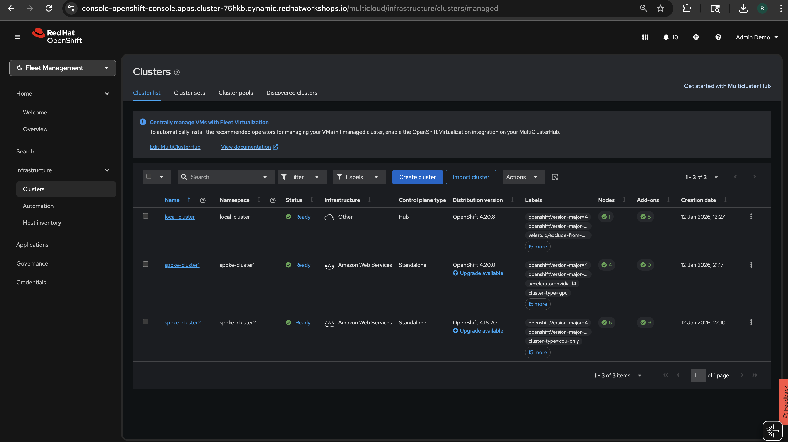
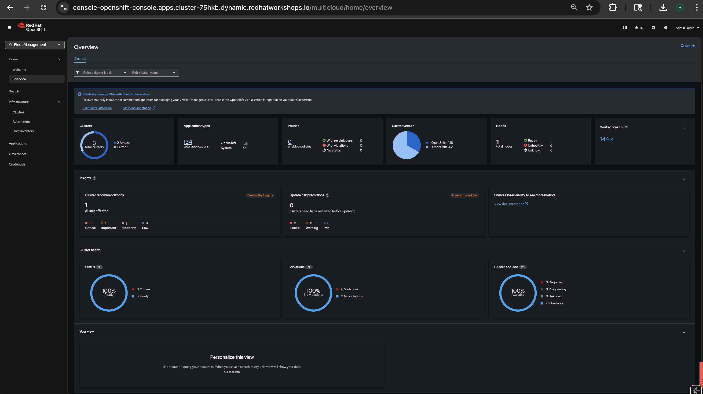

# GPUaaS with RHACM

**GPU-as-a-Service using MultiKueue and RHACM for Kubernetes-native Job Queueing at Scale**

<div class="grid cards" markdown>

- :material-play-circle:{ .lg .middle } **Interactive Demo**

    ---

    Experience the architecture and job flow visually with our rich interactive demo

    [:octicons-arrow-right-24: Launch Demo](demo/index.html){ .md-button .md-button--primary }

</div>

---

## Overview

This repository provides step-by-step instructions for setting up GPU-as-a-Service (GPUaaS) across multiple OpenShift clusters using:

| Component | Description |
|-----------|-------------|
| **Red Hat Build of Kueue (RHBoK)** | Kubernetes-native job scheduler optimized for batch workloads |
| **MultiKueue** | Extends Kueue functionality into a multi-cluster environment |
| **Red Hat Advanced Cluster Management (RHACM)** | Automates deployment, configuration, and integration of MultiKueue with Placement |

---

## Demo Environment

This demo uses **3 OpenShift clusters** managed by RHACM:



### Cluster Configuration

| Cluster | Role | Infrastructure | Nodes | Labels |
|---------|------|----------------|-------|--------|
| **local-cluster** | Hub | RHACM + Kueue Manager | 1 | - |
| **spoke-cluster1** | GPU Worker | AWS (OpenShift 4.20) | 4 | `accelerator=nvidia-l4`, `cluster-type=gpu` |
| **spoke-cluster2** | CPU Worker | AWS (OpenShift 4.18) | 6 | `cluster-type=cpu-only` |



!!! tip "Cluster Labels"
    Note the labels on each spoke cluster - these enable intelligent workload routing:
    
    - `accelerator=nvidia-l4` → GPU jobs go here
    - `cluster-type=cpu-only` → CPU-only workloads go here

---

## What You Can Do

As an administrator, you can:

- **Install Kueue add-on for RHACM** - Enable RHBoK on managed clusters automatically
- **Use Placement for MultiKueue** - Connect to spoke clusters and dispatch jobs through MultiKueue
- **Label-based cluster selection** - Select clusters with specific attributes (e.g., `nvidia-l4` GPUs)
- **Dynamic workload scheduling** - Use AddonPlacementScore to select clusters with more available GPU resources

---

## Quick Start

```bash
# On Hub Cluster - verify prerequisites
oc get multiclusterhub -A                    # RHACM installed?
oc get csv -n openshift-kueue-operator       # Kueue Operator installed?
oc get managedclusters                       # Managed clusters available?
```

Then follow the [Prerequisites](00-prerequisites.md) and [Installation](02-installation.md) guides.

---

## Demo Scenarios

| Scenario | Description | Difficulty |
|----------|-------------|------------|
| [Scenario 1: Basic](scenarios/scenario1-basic/) | Submit to hub, auto-dispatch to any cluster | ⭐ Beginner |
| [Scenario 2: Label-Based](scenarios/scenario2-label-based/) | Route GPU jobs to GPU clusters only | ⭐⭐ Intermediate |
| [Scenario 3: Dynamic Score](scenarios/scenario3-dynamic-score/) | Route to cluster with most available GPUs | ⭐⭐⭐ Advanced |

---

## Status

!!! info "Developer Preview"
    This feature is in **Developer Preview** in RHACM 2.15.

| Component | Version |
|-----------|---------|
| RHACM | 2.15 |
| OpenShift | 4.18 - 4.20 |
| Kueue Operator | 1.2.x |
| GPU | NVIDIA L4 |
