# GPUaaS with RHACM

**GPU-as-a-Service using MultiKueue and RHACM for Kubernetes-native Job Queueing at Scale**

---

<div class="grid cards" markdown>

-   :material-book-open-variant:{ .lg .middle } **Concepts**

    ---

    Learn about Kueue, MultiKueue, and RHACM integration

    [:octicons-arrow-right-24: Learn more](docs/concepts.md)

-   :material-clipboard-check:{ .lg .middle } **Prerequisites**

    ---

    What you need before starting

    [:octicons-arrow-right-24: Check requirements](docs/00-prerequisites.md)

-   :material-cog:{ .lg .middle } **Installation**

    ---

    Step-by-step setup guide

    [:octicons-arrow-right-24: Get started](docs/02-installation.md)

-   :material-play-circle:{ .lg .middle } **Demo Scenarios**

    ---

    Run the demos with your clusters

    [:octicons-arrow-right-24: Try demos](scenarios/index.md)

</div>

---

## Overview

This repository provides step-by-step instructions for setting up GPU-as-a-Service (GPUaaS) across multiple OpenShift clusters using:

| Component | Description |
|-----------|-------------|
| **Red Hat Build of Kueue (RHBoK)** | Kubernetes-native job scheduler optimized for batch workloads |
| **MultiKueue** | Extends Kueue functionality into a multi-cluster environment |
| **Red Hat Advanced Cluster Management (RHACM)** | Automates deployment, configuration, and integration of MultiKueue with Placement |

## Demo Environment

This demo uses **3 OpenShift clusters** - 1 hub and 2 spoke clusters:

| Cluster | Role | Hardware | Labels |
|---------|------|----------|--------|
| **Hub** | RHACM Hub + Kueue Manager | CPU only | - |
| **spoke-cluster1** | Worker | **NVIDIA L4 GPUs** | `accelerator=nvidia-l4` |
| **spoke-cluster2** | Worker | CPU only | `cluster-type=cpu-only` |

```mermaid
flowchart TB
    subgraph hub["🖥️ HUB CLUSTER"]
        rhacm["RHACM + MultiKueue"]
    end
    
    subgraph spoke1["spoke-cluster1"]
        gpu["🟢 NVIDIA L4 GPUs x4"]
    end
    
    subgraph spoke2["spoke-cluster2"]
        cpu["⚪ CPU Only"]
    end
    
    hub -->|"GPU Jobs"| spoke1
    hub -->|"CPU Jobs"| spoke2
```



## Quick Start

```bash
# On Hub Cluster - verify prerequisites
oc get multiclusterhub -A                    # RHACM installed?
oc get csv -n openshift-kueue-operator       # Kueue Operator installed?
oc get managedclusters                       # Managed clusters available?
```

Then follow the [Installation Guide](docs/02-installation.md) and try the [Demo Scenarios](scenarios/index.md).

!!! warning "Known Issue"
    There is a known issue where the RHACM kueue-addon incorrectly deploys hub's ClusterQueue configuration to spoke clusters. See [Troubleshooting](docs/99-troubleshooting.md) for the workaround.

## Status

!!! info "Developer Preview"
    This feature is in **Developer Preview** in RHACM 2.15.

| Component | Version |
|-----------|---------|
| RHACM | 2.15 |
| OpenShift | 4.18 |
| Kueue Operator | 1.2.x |
| GPU | NVIDIA L4 |
