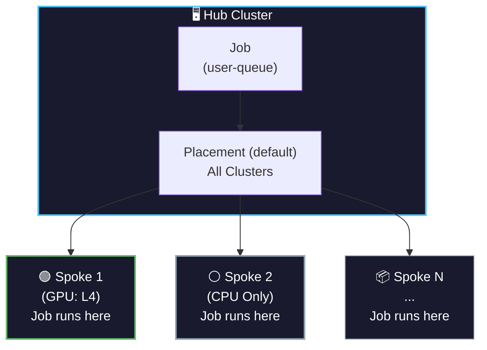

> **Difficulty:** ⭐ Beginner | **Time:** ~10 minutes

## TL;DR - Quick Start

```bash
# From this directory
cd scenarios/scenario1-basic

# 1. Apply Kueue resources
oc apply -f manifests/

# 2. Apply workaround (IMPORTANT!)
../../scripts/fix-spoke-clusterqueues.sh

# 3. Submit test job
oc create -f manifests/sample-job.yaml

# 4. Watch workload
oc get workload -n default -w
```

---

## Overview

In this scenario, we set up MultiKueue to dispatch jobs to **all managed clusters** using the default Placement.

**Use Case:** Simple load distribution across all available clusters.

## Architecture



## Prerequisites

- [Installation](../../docs/02-installation.md) completed
- At least one managed cluster available
- Workaround applied to spoke ClusterQueues (see [Troubleshooting](../../docs/99-troubleshooting.md))

## Step 1: Verify Default Placement

The default Placement selects all clusters except `local-cluster`:

```bash
# Check default Placement
oc get placement default -n openshift-kueue-operator -o yaml

# Check Placement decisions
oc get placementdecision -n openshift-kueue-operator
```

Expected output shows all spoke clusters selected.

## Step 2: Create Kueue Resources

Apply the manifests:

```bash
oc apply -f manifests/
```

Or from the repo root:

```bash
oc apply -f scenarios/scenario1-basic/manifests/
```

Or manually create:

```yaml
# ResourceFlavor
apiVersion: kueue.x-k8s.io/v1beta1
kind: ResourceFlavor
metadata:
  name: "default-flavor"
---
# ClusterQueue with AdmissionChecks
apiVersion: kueue.x-k8s.io/v1beta1
kind: ClusterQueue
metadata:
  name: "cluster-queue"
spec:
  namespaceSelector: {}
  resourceGroups:
  - coveredResources: ["cpu", "memory"]
    flavors:
    - name: "default-flavor"
      resources:
      - name: "cpu"
        nominalQuota: 100
      - name: "memory"
        nominalQuota: 256Gi
  admissionChecks:
  - multikueue-demo
  - multikueue-config-demo
---
# LocalQueue
apiVersion: kueue.x-k8s.io/v1beta1
kind: LocalQueue
metadata:
  namespace: "default"
  name: "user-queue"
spec:
  clusterQueue: "cluster-queue"
---
# AdmissionCheck for MultiKueue
apiVersion: kueue.x-k8s.io/v1beta1
kind: AdmissionCheck
metadata:
  name: multikueue-demo
spec:
  controllerName: kueue.x-k8s.io/multikueue
  parameters:
    apiGroup: kueue.x-k8s.io
    kind: MultiKueueConfig
    name: default
---
# AdmissionCheck for OCM Placement
apiVersion: kueue.x-k8s.io/v1beta1
kind: AdmissionCheck
metadata:
  name: multikueue-config-demo
spec:
  controllerName: open-cluster-management.io/placement
  parameters:
    apiGroup: cluster.open-cluster-management.io
    kind: Placement
    name: default
```

## Step 3: Verify Setup

```bash
# Check ClusterQueue
oc get clusterqueue cluster-queue

# Check LocalQueue
oc get localqueue -n default

# Check AdmissionChecks
oc get admissioncheck

# Check MultiKueueConfig was created
oc get multikueueconfig default -o yaml
```

## Step 4: Submit a Test Job

```bash
cat <<EOF | oc create -f -
apiVersion: batch/v1
kind: Job
metadata:
  generateName: demo1-cpu-job-
  namespace: default
  labels:
    kueue.x-k8s.io/queue-name: "user-queue"
spec:
  parallelism: 1
  completions: 1
  suspend: true
  template:
    spec:
      containers:
      - name: worker
        image: gcr.io/k8s-staging-perf-tests/sleep:v0.1.0
        args: ["30s"]
        resources:
          requests:
            cpu: "1"
            memory: "200Mi"
          limits:
            cpu: "1"
            memory: "200Mi"
      restartPolicy: Never
EOF
```

## Step 5: Monitor Workload

```bash
# Watch workload status
oc get workload -n default -w

# Check which cluster the job was dispatched to
oc get workload -n default -o jsonpath='{.items[0].status.nominatedClusterNames}'

# Check job on spoke cluster
KUBECONFIG=$SPOKE_KUBECONFIG oc get job -n default
```

## Expected Results

1. Job submitted to hub → Workload created
2. AdmissionChecks evaluate → nominatedClusterNames populated
3. Job dispatched to one of the spoke clusters
4. Job runs on spoke and completes
5. Status synced back to hub

## Cleanup

```bash
oc delete job -n default -l kueue.x-k8s.io/queue-name=user-queue
```

## Troubleshooting

### Job stuck in "Pending"

```bash
# Check workload status
oc get workload -n default -o yaml

# Check admission check status
oc get workload -n default -o jsonpath='{.items[0].status.admissionChecks}'
```

### Job dispatched but not running on spoke

Check spoke ClusterQueue doesn't have admission checks:

```bash
KUBECONFIG=$SPOKE_KUBECONFIG oc get clusterqueue -o yaml | grep admissionChecks
```

If it has admission checks, apply the workaround:

```bash
KUBECONFIG=$SPOKE_KUBECONFIG oc patch clusterqueue cluster-queue \
  --type=json -p='[{"op": "remove", "path": "/spec/admissionChecks"}]'
```

## Next Steps

- [Demo Scenario 2: Label-Based Selection](../scenario2-label-based/)
